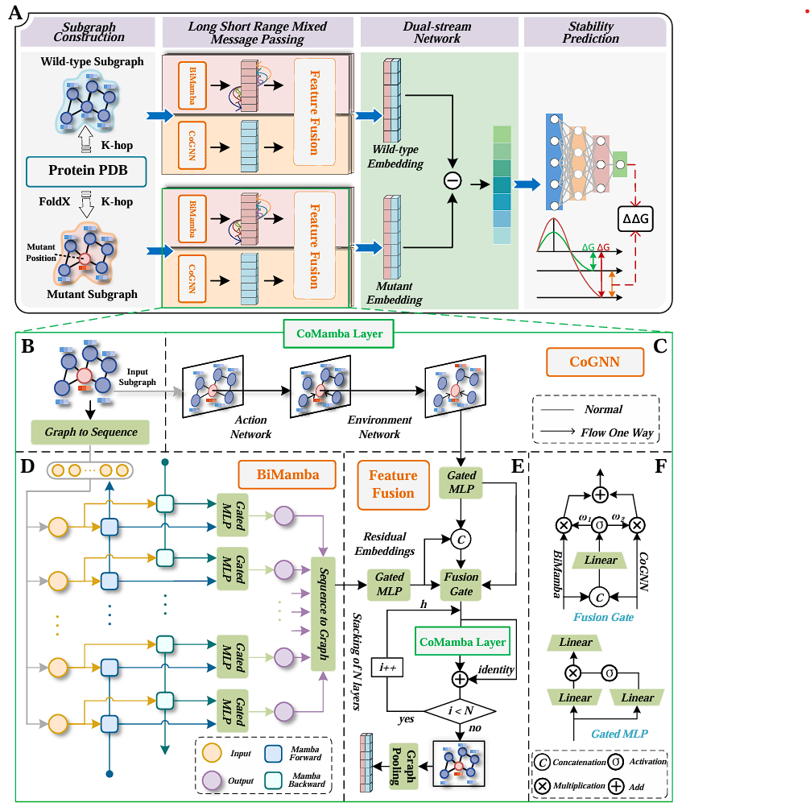

<h1 align="center">
  
</h1>


# CoM-DDG

A novel approach for predicting protein stability changes upon mutation (ΔΔG) by combining State Space Models (Mamba) with Cooperative Graph Neural Networks (CoGNN).

## Data Preparation

The datasets utilized in this study are accessible in the 'Dataset' folder. All necessary information regarding PDB IDs, DDG values, and mutation sites is provided.

### Acquiring Protein Structures

1. **Wild-type structures**: Download directly from the RCSB Protein Data Bank.

   ```bash
   # Example using wget
   wget https://files.rcsb.org/download/1BPI.pdb
   ```

2. **Mutant structures**: Generate using FoldX from wild-type structures following this procedure:

   a. Repair the wild-type PDB:

   ```
   # Create config_RE.cfg file
   command=RepairPDB
   pdb=1BPI.pdb
   ```

   b. Generate mutant:

   ```
   # Create individual_list.txt file (e.g., for mutation A4G in chain A)
   AA4G;
   
   # Create config_BM.cfg file
   command=BuildModel
   pdb=1BPI_Repair.pdb
   mutant-file=individual_list.txt
   numberOfRuns=3
   output-file=mutant_output.pdb
   ```

   c. Run FoldX:

   ```bash
   foldx -f config_RE.cfg
   foldx -f config_BM.cfg
   ```

## Feature Extraction Pipeline

### 1. Sequence Features Extraction

Sequence features are processed in multiple steps:

1. **Generate FASTA sequences from PDB files**

2. **Generate PSSM matrices using BLAST+**:

   ```bash
   # Create a batch script to run PSI-BLAST
   psiblast -db swissprot -query protein.fasta -num_iterations 3 -out_ascii_pssm protein.pssm
   ```

3. **Parse PSSM files and create a pickle file**:

   ```bash
   # Process all PSSM files in the directory
   python pssm.py
   ```

4. **Calculate conservation scores from PSSM data**:

   ```bash
   # Generate conservation scores from PSSM data
   python conservation.py
   ```

5. **Generate sequence-based graphs**:

   ```bash
   # Process PDB files into graph representations with sequence features
   python enhanced_graph_gen_v2.py
   ```

At this point, you have sequence-based features and can start training the model. For additional feature enhancement, proceed to the structure-based feature extraction.

### 2. Structure Features Extraction (Optional Enhancement)

Extract additional structural features to enhance model performance:

```bash
# Enhanced structure feature extraction
python enhanced_graph_gen_structure_simplified.py
```

This script extracts structural features including:

- Secondary structure elements
- Solvent accessible surface area
- Residue depth
- Backbone angles

## Model Architecture

The CoMamba architecture incorporates:

1. **Degree-Sorted Bidirectional Mamba**: Processes protein structure as a sequence sorted by node degree
2. **Cooperative Graph Neural Network**: Learning optimal actions for message passing
3. **Feature Fusion**: Combines representations from both models

## Model Training

Training automatically extracts k-hop subgraphs centered on mutation sites from the full protein graphs:

```bash
# Train the CoMamba model
python train_ablation_model.py
```

Key configurations can be adjusted in `config.py`:

- `NUM_HOPS`: Number of hops in k-hop subgraphs (3-4 recommended)
- `BATCH_SIZE`: Batch size for training (128, 256 recommended)
- `LEARNING_RATE`: Learning rate for optimizer (0.0012 recommended)
- `NUM_EPOCHS`: Number of training epochs (200 recommended)
- `USE_SUBGRAPHS`: Toggle k-hop subgraph extraction (True by default)

The k-hop subgraph extraction is integrated into the data loading pipeline in `data_loader_add_mut_v2.py` and occurs automatically during training.

## Prediction

To evaluate the model on test datasets:

```bash
# Run predictions
python prediction_ablation.py
```

This script:

1. Loads the trained model
2. Processes test datasets (automatically extracting k-hop subgraphs)
3. Evaluates using PCC, RMSE, and MAE metrics


## Contact

If you have any questions, please contact chenrui3074@stu.ouc.edu.cn

## Acknowledgments

- Mamba: https://github.com/state-spaces/mamba
- CoGNN: https://github.com/benfinkelshtein/CoGNN
